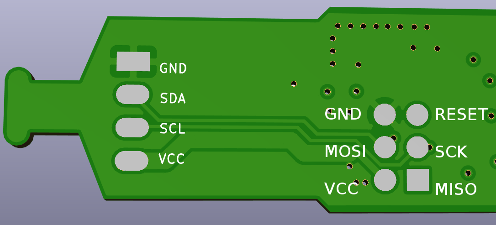

# Frequently asked questions

**Do you have the exact dimensions, or even better a CAD drawing of the sensor in 3D?**

Sensors are 18mm x 149mm. Zipped step file is available in github repository.

**How to set up multiple sensors connected to one Arduino Uno?**

You can connect several sensors to a single I2C bus. Exact maximum amount depends on many factors, mostly on the wiring length. To have several sensors working on a bus, you have to assing an individual address to each sensor. To do that, connect each sensor one by one and run an address change routine. Code is available as [an example](https://github.com/Apollon77/I2CSoilMoistureSensor/blob/master/examples/ChangeSensorI2CAddress/ChangeSensorI2CAddress.ino) of Arduino library. Raspberry Pi example is also [available](https://github.com/ageir/chirp-rpi#advanced-example-with-address-change-ability-and-calibration).

**Can I use a X meter long cable without affecting the sensor measurements?**

It depends. Note that I2C bus is not ment to run on cables, so it's a hack already. Nevertheless, a lot of products do this. I suggest reading online resources about running I2C on long cables to get some background information, but generally, to support long cables and ensure robust communication you can do the following: 
 * lower pullup resistor value, calculation is a bit complicated, but it seems you can go as low as 1k. More info [here](https://electronics.stackexchange.com/questions/1849/is-there-a-correct-resistance-value-for-i2c-pull-up-resistors).
 * slow down I2C speed. Consult your controller board documentation on how to do that
 * Use shielded cable
 
**How to solder wire to the sensor?**

Do not solder wires to the 6 pad connector - this is a programming header. Solder to 4 pads marked VCC, SCL, SDA, GND at the edge of the board. I suggest using a shielded 4 wire cable designed for security signalization installations. Do not solder the shield to the sensor, but ground it at the controller board side. Fix cable to the board using zip tie. Cover the wire connection and SMD parts with **glue-lined** heatshrink. Do not use a simple heatshrink as it will eventually let water in and will not allow it to evaporate resulting in short sensor lifetime.

**Do you offer the source code from the i2c chrip project? Can I reflash firmware of the sensor?**

Yes, sure, the sensor is open source hardware, all the code and hardware files are available on the [github page](https://github.com/Miceuz/i2c-moisture-sensor). You can use 6 pad header to program it using any AVR programming hardware like TinyISP, UsbAsp and similar. Also, you can use your [Arduino board as an AVR ISP programmer](https://www.arduino.cc/en/Tutorial/ArduinoISP).


**Communication with ESP8266-based systems is unreliable, sensor sends data then stops working.**

In depth technical analysis is [available here](https://github.com/Apollon77/I2CSoilMoistureSensor/issues/8#issuecomment-295715953).

Add this call after you initialize I2C bus:
```
  Wire.setClockStretchLimit(4000); 
```

**How durable are non-rugged sensors?**

Standard solder mask seems to last about 3 months before flaking off. It really depends on the type of your soil and how often do you remove and insert the sensor as scratches will damage the surface and shorten the lifespan. I have had sensors working flawlessly for over a year in the flower pot at home when not disturbed. Note that you **must** protect sensor electronics with **glue-lined** heatshrink if you are going to install it outdoors. I use [this heatshrink](https://www.tme.eu/en/details/cb-dwt16-4x_1m-bk/heat-shrink-tubes/cyg/cb-dwt4x-160/) but you can use any similar one.

**Can you set different address for each sensor before shipping?**

Yes I can for orders of 50pcs or more, please drop me an email - mic at wemakethings net

## Rugged sensors

**How do I connect the sensor to my board?**

Wire colors go like this:
 * RED - VCC
 * BLACK - GND
 * BLUE or GREEN- SDA
 * YELLOW - SCK 

You can leave the metal sheet and metal wire unconnected for a quick test, but connect it to GND for proper installation.

Please check if your controller board has onboard pullup resistors for I2C. You need to add pull up resistors to both SCL and SDA lines if they are not there. Raspberry Pi has pullups onboard, Arduino UNO does not.

**What is the expected life of the rugged sensor for continuous use outdoor?**

I still don't have enough data to answer this question. Rugged sensors should be in practice indestructable, but failures sometimes happen. If you are using rugged sensor please let me know about the failures you experience. 

**Light sensor of rugged variant?**

Light sensing does not work for rugged sensors as light sensor is covered by heatshrink.

**I would like to have sensors with a cable up to X meters**

Sometimes I can provide customization for orders over 50 pcs, please drop me an email - mic at wemakethings net.

## Miscelaneous

**Can you provide a formal EU invoice?**

Yes, I can, please contact me directly via email - mic at wemakethings net

